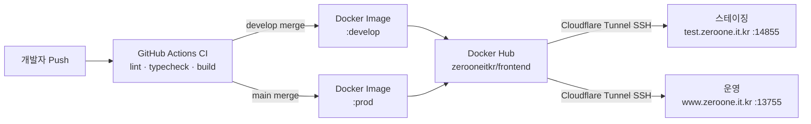

# ZERO-ONE 스터디 플랫폼

> 바이브코더와 개발자가 동반 성장하는 IT 커리어 학습 커뮤니티

[](https://nextjs.org/)
[](https://react.dev/)
[](https://www.typescriptlang.org/)
[](https://yarnpkg.com/)

| 환경 | URL | 배포 트리거 |
|------|-----|------------|
| 스테이징 | https://test.zeroone.it.kr | `develop` push |
| 운영 | https://www.zeroone.it.kr | `main` push |

---

## 목차

1. [빠른 시작](#1-빠른-시작)
2. [브랜치 전략](#2-브랜치-전략)
3. [프로덕트 기능](#3-프로덕트-기능)
4. [기술 스택](#4-기술-스택)
5. [폴더 구조](#5-폴더-구조)
6. [인프라](#6-인프라)
7. [주요 리소스](#7-주요-리소스)

---

## 1. 빠른 시작

**요구사항:** Node.js ≥ 20, Yarn 1.22+

```bash
cp .env.example .env.local  # 환경 변수 설정 (하단 표 참고)
yarn install
yarn dev  # http://localhost:3000
```

### 주요 명령어

| 명령어 | 설명 |
|--------|------|
| `yarn dev` | Turbopack 개발 서버 |
| `yarn build` | 프로덕션 빌드 |
| `yarn lint:fix` | ESLint 자동 수정 |
| `yarn prettier:fix` | Prettier 자동 포맷 |
| `yarn typecheck` | TypeScript 타입 검사 |
| `yarn storybook` | Storybook 개발 서버 (포트 6006) |
| `yarn generate:api <이름>` | API 쿼리 훅 보일러플레이트 생성 |

### 환경 변수

| 변수 | 설명 |
|------|------|
| `NEXT_PUBLIC_API_BASE_URL` | 백엔드 API 엔드포인트 |
| `NEXT_PUBLIC_KAKAO_CLIENT_ID` | 카카오 OAuth |
| `NEXT_PUBLIC_GOOGLE_CLIENT_ID` | 구글 OAuth |
| `NEXT_PUBLIC_TOSS_CLIENT_KEY` | 토스페이먼츠 |
| `NEXT_PUBLIC_STRAPI_URL` | CMS URL |
| `NEXT_PUBLIC_SENTRY_DSN` | Sentry DSN (없으면 비활성화) |

---

## 2. 브랜치 전략

```
main ◄─── develop ◄─── feat/*, fix/*, refactor/*, docs/*, chore/* ...
```

### 개발 흐름

1. `develop` 기준으로 작업 브랜치 생성
2. 작업 완료 → `develop`으로 PR
3. **CI 통과** 후 merge → **스테이징 자동 배포**
4. 스테이징 검증 완료 → `develop → main` PR
5. merge → **운영 자동 배포**

### 브랜치 명명 / 커밋 컨벤션

브랜치와 커밋 prefix를 동일하게 맞춥니다. **콜론 앞뒤 공백 필수.**

```
feat : 새 기능      →  feat/기능명
fix : 버그 수정     →  fix/버그명
refactor : 개선     →  refactor/이름
style : 포맷 변경   →  style/이름
docs : 문서         →  docs/이름
test : 테스트       →  test/이름
chore : 빌드·설정   →  chore/이름
```

### CI 체크 목록 (PR merge 전 전원 통과 필수)

| 체크 | 명령어 |
|------|--------|
| ESLint | `yarn lint` (`--max-warnings=0`) |
| TypeScript | `yarn typecheck` |
| Prettier | `yarn prettier` |
| Next.js 빌드 | `yarn build` |
| Storybook 빌드 | `yarn build-storybook` |
| Chromatic 스냅샷 | `develop` push 시 자동 실행 |

---

## 3. 프로덕트 기능

| 도메인 | 설명 |
|--------|------|
| 그룹스터디 | 공동 학습형 스터디 개설·운영·미션·피어리뷰 |
| 프리미엄스터디 | 멘토 주도 교육형 스터디, 과제·평가 포함 (유료) |
| 1:1 멘토링 | 전문 멘토와 1:1 상담·노트 상담 |
| 1:1 스터디 | 1:1 기반 스터디 스케줄·토론·히스토리 |
| 커뮤니티 | 자유 게시글 작성·댓글·소통 |
| 인사이트 | 학습 인사이트 콘텐츠 |
| 마이페이지 | 내 스터디·멘토링·리뷰·결제·알림 |
| 결제 | 토스페이먼츠 연동, 결제·환불·정산 |
| 관리자 | 유저·매칭·멘토 심사/운영·정산 관리 |

> 📌 각 도메인 상세 정책(미션·과제·평가·피어리뷰 등)은 [Notion 도메인 정책 문서](https://www.notion.so/gaan/1-1-1-1-30ffbb391d7980169a34e834a13e77b1)를 참고하세요.

### ⚠️ 도메인 혼동 주의: 1:1 멘토링 vs 프리미엄스터디

코드베이스에서 두 도메인이 혼용되기 쉬우니 반드시 구분하세요.

| | **1:1 멘토링** | **프리미엄스터디** |
|---|---|---|
| URL | `/mentoring/*` | `/premium-study/*` |
| API | `/api/v1/mentors` | `/api/v1/group-studies` |
| 참여 형태 | 1:1 개인 상담 | 1:N 그룹 교육 |
| 과금 | 별도 정책 | 유료 only |

---

## 4. 기술 스택

| 분류 | 기술 |
|------|------|
| 프레임워크 | Next.js 15 (App Router, Turbopack), React 19, TypeScript 5 |
| 서버 상태 | TanStack Query 5 |
| 클라이언트 상태 | Zustand 5 |
| 폼 | React Hook Form + Zod |
| 스타일링 | Tailwind CSS 4, Radix UI, Framer Motion |
| API | Axios + OpenAPI Generator |
| 결제 | Toss Payments SDK |
| 에디터 | Tiptap, Slate |
| 모니터링 | Sentry, Microsoft Clarity, GTM |
| 테스트 | Vitest, Playwright, Storybook + Chromatic |
| CI/CD | GitHub Actions → Docker Hub → Cloudflare Tunnel |

---

## 5. 폴더 구조

```
src/
├── app/                    # Next.js App Router
│   ├── (landing)/          # 공개 랜딩 (/)
│   ├── (service)/          # 인증 필요 서비스 영역
│   ├── (my)/               # 마이페이지 영역
│   └── (admin)/            # 관리자 (ROLE_ADMIN 보호)
│
├── features/               # 도메인별 기능 모듈
│   ├── admin/              # 관리자 로직·UI
│   ├── auth/               # 인증 (OAuth, 미들웨어 정책)
│   ├── mentoring/          # 1:1 멘토링 도메인
│   └── study/              # 스터디 도메인
│
├── components/             # UI 컴포넌트
│   ├── common/             # Header, Footer, Modal, Toast 등 공통
│   └── pages/              # 페이지 단위 조합 컴포넌트
│
├── hooks/queries/          # TanStack Query 훅
│
├── api/
│   ├── client/             # Axios 인스턴스 + 인터셉터
│   ├── endpoints/          # 커스텀 엔드포인트 래퍼
│   └── openapi/            # ⚠️ 자동 생성 파일 — 직접 수정 금지
│
├── stores/                 # Zustand 전역 상태
├── types/
│   ├── api/                # API 응답 타입
│   └── schemas/            # Zod 검증 스키마
├── config/                 # query-client, sentry, 상수
├── utils/                  # error-handler 등 공통 유틸
└── middleware.ts            # 라우트 보호 미들웨어
```

### API 훅 추가 방법

신규 API는 OpenAPI 자동 생성 방식을 권장합니다.

```bash
yarn generate:api <swagger-api-타이틀-이름>
# 예: yarn generate:api bank-search-api
# → src/hooks/queries/bank-search-api.ts 생성
```


생성된 파일에 TanStack Query 훅을 작성합니다:

```typescript
import { createApiInstance } from '@/api/client/open-api-instance';
import { BankSearchApi } from '@/api/openapi';
import { useQuery } from '@tanstack/react-query';

const bankSearchApi = createApiInstance(BankSearchApi);

export const useSearchBanks = () => {
  return useQuery({
    queryKey: ['bankSearch'],
    queryFn: async () => {
      const { data } = await bankSearchApi.getBanks();
      return data.content;
    },
    staleTime: 1000 * 60 * 60,
  });
};
```

백엔드 Swagger: https://test-api.zeroone.it.kr/swagger-ui/index.html

---

## 6. 인프라



### 외부 서비스 연동

| 서비스 | 용도 |
|--------|------|
| Kakao / Google OAuth | 소셜 로그인 |
| Toss Payments | 결제 |
| Sentry | 에러 모니터링 (AUTH001 제외) |
| Microsoft Clarity | UX 분석 |
| Google Tag Manager | 마케팅 분석 (운영 only) |
| Strapi | CMS |
| Storybook + Chromatic | 컴포넌트 스냅샷 관리 |

---

## 7. 주요 리소스

### 커뮤니케이션 & 협업

| 플랫폼 | 링크 | 용도 |
|--------|------|------|
| **Discord** | [온라인 회의 채널](https://discord.com/channels/1139603309246828554/1384082110947655782) | 온라인 회의 (전체) |
| **Slack** | [초대 링크](https://join.slack.com/t/goodmorning-cs-study/shared_invite/zt-376x9ja4h-Ww6vbT3SfvsEZF~OPynswg) | 커뮤니케이션 전반 |
| **Jira** | [작업 관리](https://code-zero-to-one.atlassian.net/jira/software/projects/QNRR/boards/4/timeline) | 작업 일정 및 이슈 관리 |

### 개발 리소스

| 리소스 | 링크 | 용도 |
|--------|------|------|
| **GitHub (프론트)** | [study-platform-client](https://github.com/code-zero-to-one/study-platform-client) | 코드 저장소, PR, 코드리뷰 |
| **GitHub (백엔드)** | [study-platform-mvp](https://github.com/code-zero-to-one/study-platform-mvp) | 백엔드 API 저장소 |
| **Notion (설계문서)** | [기획 & 설계](https://www.notion.so/gaan/13efbb391d7980cea50fc6864d60f4f7?p=1f4fbb391d79803e8ebbf4cc69e676b2&pm=s) | 화면정의, 기능명세, ERD 등 |
| **도메인 정책** | [정책 문서](https://www.notion.so/gaan/1-1-1-1-30ffbb391d7980169a34e834a13e77b1) | 스터디·멘토링 도메인 정책 |
| **Backend 개발문서** | [Notion](https://www.notion.so/gaan/1c8d60669f1a47568edc8f960c6f8ac7?pvs=4) | API 문서 / 개발 가이드 |

### 디자인 & UI

| 리소스 | 링크 | 용도 |
|--------|------|------|
| **Figma** | [Design System & Ready for Dev](https://www.figma.com/files/team/1484794295279518167/project/355437950/zeros?fuid=1310644189038769508) | 디자인 시스템, 개발용 가이드 |
| **Storybook** | [Chromatic](https://www.chromatic.com/builds?appId=67fe01503649b6b099af8e4e) | 프론트 컴포넌트 확인 |

### 배포 환경

| 환경 | URL | 배포 트리거 |
|------|-----|------------|
| 프론트 스테이징 | https://test.zeroone.it.kr | `develop` push |
| 프론트 운영 | https://www.zeroone.it.kr | `main` push |
| 백엔드 스테이징 | https://test-api.zeroone.it.kr | `dev` push |
| 백엔드 운영 | https://api.zeroone.it.kr | `main` push |
| Swagger (스테이징) | https://test-api.zeroone.it.kr/swagger-ui/index.html | 백엔드 API 명세 |
