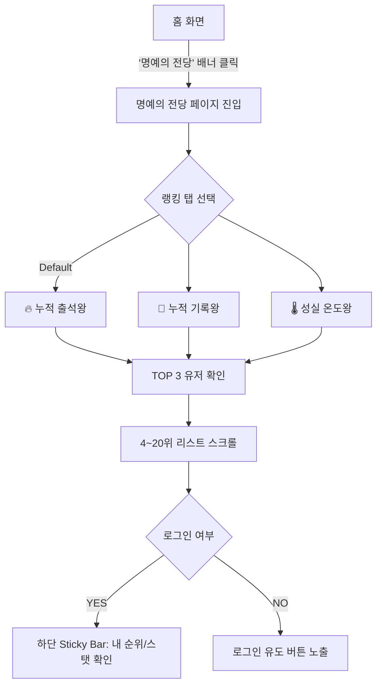

| 버전   | 업데이트일시 (KST)        | 설명      |
| ------ | ------------------------- | --------- |
| v1.0.0 | 2026년 1월 12일 오후 9:16 | 초안 작성 |

# 1. 기획배경

---

## 1.1 현행 상황 (관찰 기반)

현재 1:1 스터디 실사용 유저는 경력직 비중이 높고, 꾸준히 사용하는 유저들은 활동 품질이 높은 편이다. 또한 사용자 규모가 아직 크지 않아, 1:1 스터디 이용자들끼리는 서로를 대부분 인지하고 소속감이 형성된 상태다.

이 상황에서 현재 존재하는 강점(유저 품질, 반복 사용, 커뮤니티 결속)을 제품 안에서 드러내고 강화하는 전략을 구사한다.

---

## 1.2 현행 문제 정의 (가치 전달의 누락)

플랫폼 내부에는 스터디 횟수, 출석, 자료 공유, 후기, 매너온도 등 의미 있는 활동 데이터가 이미 누적되고 있다. 그러나 이 데이터가 다음 사용자 가치로 **전환되지 못하고 있다.**

### 1) 고품질 유저가 존재한다는 사실이 사용자에게 전달되지 않음

현재는 “이 서비스에서 어떤 사람들이 실제로 활동하는지”를 사용자가 제품 안에서 확인하기 어렵다. 그래서 신규/잠재 사용자는 고품질 유저가 존재해도 이를 인지하지 못하고, 서비스의 신뢰와 기대감이 약해진다.

### 2) 소속감이 행동으로 이어지는 장치가 부족함

1:1 스터디 이용자들 사이에는 이미 서로를 아는 분위기와 소속감이 있는데, 이를 “한 번 더 하게 만드는” 구체적인 자극(경쟁/목표/기준점)으로 연결하는 기능이 부족하다. 결과적으로 커뮤니티 결속이 있어도 참여 빈도를 끌어올리는 데 한계가 생긴다.

### 3) 성실함이 공개적으로 인정되는 구조가 약함

열심히 한 기록이 개인 내부에만 남으면 성취감이 제한적이다. 활동 데이터가 있어도 “다른 사람이 볼 수 있는 결과물”로 정리되어 있지 않으면, 인정과 동기부여 효과가 약해진다.

### 4) 활동이 ‘존재한다’는 신호가 약함

서비스 첫인상에서 “사람이 실제로 활동하고 있다”는 신호는 참여 결정에 영향을 준다. 현재는 활동이 누적되어 있어도 이를 한 화면에서 보여주는 구조가 약해, 서비스의 활력 신호가 충분히 전달되지 않는다.

---

## 1.3 해결 방안 (명예의 전당 도입 목적)

명예의 전당은 누적된 활동 데이터를 **랭킹 형태로 구조화**하여, 아래 4가지를 제품 안에서 직접 만들어낸다.

1. **고품질 유저가 활동 중이라는 사실을 근거와 함께 보여준다**

- 경력직/고활동 유저가 실제로 존재한다는 점을 “말”이 아니라 **데이터 기반 화면**으로 전달한다.

1. **소속감이 있는 집단에서 경쟁을 참여로 연결한다**

- 스터디 횟수, 자료 공유 횟수 등 명확한 메트릭을 통해 “이번 주 한 번 더” 같은 행동 유도를 만든다.

1. **개인의 성실함이 공개적으로 인정되는 구조를 만든다**

- 누적 결과가 공개되고 비교 가능해지면, 성취가 강화되고 지속 사용 동기가 생긴다.

4.  **서비스가 활발하다는 인지 신호를 강화한다**

- 랭킹/누적 수치/활동 요약은 “활동이 있는 서비스”라는 신호를 제공해 참여 장벽을 낮춘다.

# 2. 주요 기능 구성 (대분류)

---

| 구분       | 기능명                    | 설명                                                                | 비고      |
| ---------- | ------------------------- | ------------------------------------------------------------------- | --------- |
| **메인**   | **명예의 전당 홈**        | 3가지 테마(출석, 기록, 온도)별 누적 랭킹을 조회하는 메인 페이지     |           |
| **조회**   | **TOP 3 하이라이트**      | 각 테마별 1~3위 유저를 왕관, 강조 UI 등으로 특별 대우하여 노출      |           |
| **조회**   | **전체 랭킹 리스트**      | 4위 ~ 20위 유저를 리스트 형태로 노출 (무한 스크롤 X, 상위권만 집중) |           |
| **개인화** | **내 순위 보기 (Sticky)** | 로그인 유저의 현재 전체 등수와 상위 백분위(%)를 하단에 고정 노출    |           |
| **시스템** | **랭킹 산정 로직**        | 전체 기간 누적 데이터를 기반으로 점수 산출 및 동점자 처리           | 배치/캐싱 |

---

# 3. 화면 구성

## 3.0 위치(IA) / 진입 경로

1. **상단 글로벌 탭에서 `1:1 스터디` 진입**
2. `1:1 스터디` 탭 내부의 서브 메뉴에서 **`명예의 전당` 선택**

- 즉, **명예의 전당은 1:1 스터디 탭 내부 기능**임

## 3.1 페이지 헤더/타이틀

- 페이지 타이틀: **명예의 전당**
- 본 문서 범위: **명예의 전당 본문 영역만** (사이드 카드/달력/개인 프로필 위젯 등은 제외)

## 3.2 랭킹 테마 전환(상단 버튼)

- 테마 버튼 3개
  1. **🔥 불꽃 출석왕**
  2. **📝 열정 기록왕**
  3. **🌡️ 성실 온도왕**
- 선택된 테마는 **활성 스타일(강조)**로 표시
- 테마 전환 시 아래 콘텐츠가 전부 해당 테마 기준으로 갱신됨
  - TOP 3 하이라이트
  - 전체 랭킹 테이블
  - (필요 시) 검색/필터 결과

## 3.3 필터 / 검색

- 직무 필터 드롭다운: 기본값 **모든 직무**
- 닉네임 검색 입력: **닉네임 검색**
- 동작 규칙
  1. 필터/검색은 **현재 선택된 테마의 랭킹 목록에만** 적용
  2. 검색 결과가 없으면 **빈 상태 문구** 노출(아래 3.7 참고)

## 3.4 TOP 3 하이라이트 카드

- 1~3위 유저를 카드로 크게 노출
- 1위 카드는 **가장 크게/가장 강하게 강조**(중앙 배치 + 테두리 강조 느낌)
- 카드에 포함되는 핵심 정보(테마에 따라 라벨만 변경)
  - 닉네임
  - 테마 점수(예: 출석왕이면 `150회`처럼 크게)
  - 보조 지표 2개(이미지 기준으로 “최근 활동/누적 학습”처럼 **2줄 요약 정보**가 들어감)
- 카드 클릭 시: **해당 유저 프로필 모달(또는 패널) 오픈** (필수)

## 3.5 전체 랭킹 테이블(리스트)

- 표 컬럼 구조(이미지 기준)
  - **RANK**: 순위
  - **MEMBER**: 프로필 이미지 + 닉네임 + (보조로 직무/태그 텍스트)
  - **SCORE**: 테마 점수(출석=회, 기록=개, 온도=°C 등)
  - **ACTIVITY**: 활동 요약(예: 누적 시간/최근 활동 시점 등)
- 행(Row) 클릭 시: **해당 유저 프로필 모달(또는 패널) 오픈** (필수)
- 표는 “상위 4~”처럼 이어지는 구조지만, 실제 서비스에서는 **필터/검색/페이지네이션과 함께 전체 등수 탐색**이 가능해야 함

## 3.6 페이지네이션

- 하단에 페이지 컨트롤이 존재(예: `1 / 134`)
- 동작 규칙
  - 페이지 이동 시 현재 테마 + 필터 + 검색 조건을 유지한 채 다음 결과 로드

## 3.7 빈 상태(Empty State)

- 케이스
  1. 해당 테마에 집계 데이터가 아직 없음
  2. 필터/검색 결과가 없음
- 문구 예시
  - 데이터 없음: **“아직 전설이 탄생하지 않았어요. 첫 주인공이 되어보세요!”**
  - 검색 결과 없음: **“조건에 맞는 유저가 없어요. 다른 키워드로 찾아볼까요?”**

# 4. 기능 요구사항 상세

## 4.1 랭킹 산정 기준 (Logic) - 전체 누적

### 4.1.0🔥 불꽃 출석왕

- 산정: `COUNT(attendance)` WHERE `status IN ('PRESENT','ATTENDED')`
- 기간: 가입일 ~ 현재 **누적**
- 동점자: **가입일 빠른 순**
- 화면 SCORE 단위: **회**

### 4.1.1 📝 열정 기록왕

- 산정: `COUNT(daily_study)` WHERE `deleted_at IS NULL`
- 기간: 가입일 ~ 현재 **누적**
- 동점자: `description` **총 글자 수 많은 순**
- 화면 SCORE 단위: **개(기록 수)**

### 4.1.2 🌡️ 성실 온도왕

- 산정: `member_profile.real_sincerity_temp` (현재값)
- 대상: **활성 유저만**(예: 최근 3개월 내 로그인/출석 이력)
- 동점자: **최근 접속 최신 순**
- 화면 SCORE 단위: **°C**

## 4.2 UI/UX 요구사항

- **TOP 3 카드:** 압도적인 누적 수치(예: "총 1,240회 출석")를 크게 보여주어 위압감 조성.
- **내 순위 바:** 랭킹권(1~20위) 밖이어도 "현재 145위 (상위 12%)" 형태로 나의 위치를 알려주어 도전 의식 고취.

---

# 5. 사용자 플로우 (User Flow)

## 5.1 랭킹 조회 플로우

# 6. 요구사항 명세서(SRS) - 제로원 명예의 전당 (MVP)

| 회차 | 대상   | 분류     | 기능명                     | 기능설명                                                                       | 비고      |
| ---- | ------ | -------- | -------------------------- | ------------------------------------------------------------------------------ | --------- |
| 1차  | 사용자 | 진입     | **명예의 전당 진입**       | 사용자는 **1:1 스터디 탭 내부**에서 서브 메뉴 **명예의 전당**을 눌러 진입한다. | 위치 고정 |
| 1차  | 사용자 | 조회     | **랭킹 테마 전환**         | 사용자는 3개 테마 버튼(출석/기록/온도)을 눌러 랭킹 기준을 전환할 수 있다.      |           |
| 1차  | 사용자 | 조회     | **TOP 3 하이라이트**       | 각 테마의 1~3위를 카드로 크게 노출하며 1위는 가장 강하게 강조한다.             |           |
| 1차  | 사용자 | 탐색     | **직무 필터**              | 직무 드롭다운(기본: 모든 직무)으로 목록을 필터링할 수 있다.                    |           |
| 1차  | 사용자 | 탐색     | **닉네임 검색**            | 닉네임 키워드로 랭킹 목록을 검색할 수 있다.                                    |           |
| 1차  | 사용자 | 조회     | **랭킹 테이블**            | 순위/유저/점수/활동 정보가 테이블로 노출된다.                                  |           |
| 1차  | 사용자 | 이동     | **페이지네이션**           | 사용자는 페이지 단위로 다음 랭킹을 조회할 수 있다.                             |           |
| 1차  | 사용자 | 상호작용 | **유저 프로필 보기(필수)** | TOP3 카드 또는 테이블 행 클릭 시 **해당 유저 프로필 모달/패널이 노출**된다.    | 필수      |
| 1차  | 시스템 | 성능     | **랭킹 캐싱**              | 랭킹은 매 요청마다 풀계산하지 않고 일정 시간 캐싱해 빠르게 제공한다.           | 예: 1시간 |

# 미리보기 (예시)

이렇게 별개의 페이지 혹은 사이드탭에서 누적/실시간 랭킹 표현
